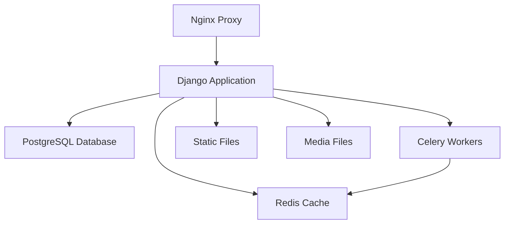

# 🦷 Dental Clinic Management System

<div align="center">


**A comprehensive dental clinic management system built with Django**

[🌐 Live Demo](https://sbdental.ir) • [📖 Documentation](#documentation) • [🚀 Quick Start](#quick-start)

</div>

---

## 📋 Table of Contents

- [✨ Features](#-features)
- [🏗️ Architecture](#️-architecture)
- [🚀 Quick Start](#-quick-start)
- [🐳 Docker Deployment](#-docker-deployment)
- [⚙️ Configuration](#️-configuration)
- [📁 Project Structure](#-project-structure)
- [🔧 Development](#-development)
- [🌐 API Endpoints](#-api-endpoints)
- [🤝 Contributing](#-contributing)
- [📄 License](#-license)

---

## ✨ Features

### 🏥 Core Functionality
- **Patient Management** - Complete patient records and history
- **Appointment Scheduling** - Advanced booking system with calendar integration
- **Doctor Dashboard** - Comprehensive doctor profiles and schedules
- **Service Management** - Dental services catalog with detailed descriptions
- **Gallery System** - Before/after photos and clinic gallery
- **Blog System** - Educational content and news management

### 🔒 Security & Authentication
- **Multi-level Authentication** - Custom user system with role-based access
- **Brute Force Protection** - Django Axes integration
- **reCAPTCHA Integration** - Google reCAPTCHA v3 protection
- **Secure Admin Panel** - Randomized admin URLs
- **Password Reset System** - Secure OTP-based password recovery

### 🎨 User Experience
- **Responsive Design** - Mobile-first approach
- **Persian/Farsi Support** - Full RTL language support
- **Rich Text Editor** - CKEditor 5 with Persian language pack
- **Advanced Caching** - Redis-powered caching system
- **SEO Optimized** - Meta tags and structured data

### 🚀 Performance & Scalability
- **Celery Task Queue** - Asynchronous task processing
- **Redis Caching** - High-performance caching layer
- **Database Optimization** - Efficient queries with select_related/prefetch_related
- **Static File Optimization** - Compressed and minified assets
- **Docker Support** - Containerized deployment

---

## 🏗️ Architecture



### Technology Stack

| Component | Technology | Version |
|-----------|------------|---------|
| **Backend** | Django | 5.1.7 |
| **Database** | PostgreSQL | 15 |
| **Cache** | Redis | Latest |
| **Task Queue** | Celery | 5.4.0 |
| **Web Server** | Nginx | Latest |
| **WSGI Server** | Gunicorn | 23.0.0 |
| **Containerization** | Docker | Latest |

---

## 🚀 Quick Start

### Prerequisites

- Python 3.11+
- PostgreSQL 15+
- Redis
- Git

### 1. Clone the Repository

```bash
git clone https://github.com/amirhosein2004/Dental.git
cd Dental
```

### 2. Create Virtual Environment

```bash
python -m venv venv
source venv/bin/activate  # On Windows: venv\Scripts\activate
```

### 3. Install Dependencies

```bash
pip install -r requirements.txt
```

### 4. Environment Configuration

Create a `.env` file in the project root:

```env
# Django Settings
SECRET_KEY=your-secret-key-here
DEBUG=True
ALLOWED_HOSTS=localhost,127.0.0.1

# Database Configuration
DB_ENGINE=django.db.backends.postgresql
DB_NAME=dental_db
DB_USER=your_db_user
DB_PASSWORD=your_db_password
DB_HOST=localhost
DB_PORT=5432

# Redis Configuration
REDIS_URL=redis://127.0.0.1:6379/1
REDIS_URL_CELERY=redis://localhost:6379/0

# Email Configuration
EMAIL_BACKEND=django.core.mail.backends.smtp.EmailBackend
EMAIL_HOST=smtp.gmail.com
EMAIL_PORT=587
EMAIL_USE_TLS=True
EMAIL_HOST_USER=your-email@gmail.com
EMAIL_HOST_PASSWORD=your-app-password

# reCAPTCHA Keys
RECAPTCHA_PUBLIC_KEY=your-recaptcha-public-key
RECAPTCHA_PRIVATE_KEY=your-recaptcha-private-key

# Security
OTP_SECRET_KEY=your-otp-secret
RESET_PREFIX=your-reset-prefix
RESET_SUFFIX=your-reset-suffix
SECURE_ADMIN_PANEL=your-admin-url
```

### 5. Database Setup

```bash
python manage.py makemigrations
python manage.py migrate
python manage.py createsuperuser
```

### 6. Collect Static Files

```bash
python manage.py collectstatic
```

### 7. Run Development Server

```bash
python manage.py runserver
```

Visit `http://127.0.0.1:8000` to see the application.

---

## 🐳 Docker Deployment

### Quick Docker Setup

```bash
# Clone the repository
git clone https://github.com/amirhosein2004/Dental.git
cd Dental

# Create .env file (see configuration section)
cp .env.example .env

# Build and run with Docker Compose
docker-compose up -d

# Run migrations
docker-compose exec web python manage.py migrate

# Create superuser
docker-compose exec web python manage.py createsuperuser

# Collect static files
docker-compose exec web python manage.py collectstatic --noinput
```

### Docker Services

The Docker setup includes:

- **Web**: Django application with Gunicorn
- **Database**: PostgreSQL 15
- **Cache**: Redis
- **Celery Worker**: Background task processing
- **Celery Beat**: Scheduled tasks
- **Nginx**: Reverse proxy and static file serving

---

## ⚙️ Configuration

### Environment Variables

| Variable | Description | Default |
|----------|-------------|---------|
| `SECRET_KEY` | Django secret key | Auto-generated |
| `DEBUG` | Debug mode | `False` |
| `ALLOWED_HOSTS` | Allowed hosts | `*` |
| `DB_ENGINE` | Database engine | `sqlite3` |
| `REDIS_URL` | Redis cache URL | `redis://127.0.0.1:6379/1` |
| `EMAIL_HOST` | SMTP host | `smtp.gmail.com` |
| `LANGUAGE_CODE` | Language code | `en-us` |
| `TIME_ZONE` | Time zone | `UTC` |

### Django Apps

The project consists of the following Django applications:

- **`home`** - Homepage and landing pages
- **`accounts`** - User authentication and profiles
- **`dashboard`** - Doctor dashboard and management
- **`service`** - Dental services management
- **`blog`** - Blog and news system
- **`gallery`** - Image gallery management
- **`contact`** - Contact forms and information
- **`about`** - About pages and clinic information
- **`core`** - Core models and utilities
- **`users`** - Custom user model

---

## 📁 Project Structure

```
Dental/
├── 📁 Dental/                 # Main Django project
│   ├── 📁 settings/           # Environment-specific settings
│   │   ├── base.py           # Base settings
│   │   ├── dev.py            # Development settings
│   │   └── prod.py           # Production settings
│   ├── urls.py               # Main URL configuration
│   ├── wsgi.py               # WSGI configuration
│   └── celery.py             # Celery configuration
├── 📁 home/                   # Homepage app
├── 📁 accounts/               # Authentication app
├── 📁 dashboard/              # Doctor dashboard
├── 📁 service/                # Services management
├── 📁 blog/                   # Blog system
├── 📁 gallery/                # Gallery management
├── 📁 contact/                # Contact system
├── 📁 about/                  # About pages
├── 📁 core/                   # Core functionality
├── 📁 users/                  # Custom user model
├── 📁 utils/                  # Utility functions
├── 📁 templates/              # Global templates
├── 📁 static/                 # Static files
├── 📁 media/                  # User uploads
├── requirements.txt           # Python dependencies
├── docker-compose.yml         # Docker configuration
├── Dockerfile                 # Docker image
├── nginx.conf                 # Nginx configuration
└── manage.py                  # Django management script
```

---

## 🔧 Development

### Setting up Development Environment

1. **Install development dependencies**:
   ```bash
   pip install -r requirements.txt
   ```

2. **Enable debug toolbar**:
   ```python
   # In .env file
   DEBUG=True
   ```

### Code Style

The project follows Django best practices:

- **PEP 8** compliance
- **Class-based views** for better organization
- **Model managers** for complex queries
- **Custom middleware** for additional functionality
- **Comprehensive caching** strategy

### Database Migrations

```bash
# Create new migrations
python manage.py makemigrations

# Apply migrations
python manage.py migrate

# Show migration status
python manage.py showmigrations
```

---

### Authentication Endpoints

- `POST /auth/login/` - User login
- `POST /auth/logout/` - User logout
- `POST /auth/register/` - User registration
- `POST /auth/password-reset/` - Password reset request
- `POST /auth/password-reset-confirm/` - Password reset confirmation

---

## 🤝 Contributing

We welcome contributions! Please follow these steps:

1. **Fork the repository**
2. **Create a feature branch**: `git checkout -b feature/amazing-feature`
3. **Commit your changes**: `git commit -m 'Add amazing feature'`
4. **Push to the branch**: `git push origin feature/amazing-feature`
5. **Open a Pull Request**

### Development Guidelines

- Follow Django coding standards
- Write comprehensive tests
- Update documentation
- Use meaningful commit messages
- Ensure backward compatibility

---

## 📄 License

This project is licensed under the MIT License - see the [LICENSE](LICENSE) file for details.

---

## 🙏 Acknowledgments

- **Django Community** for the excellent framework
- **Persian Django Community** for localization support
- **Contributors** who helped improve this project

---

## 📞 Support

- **Website**: [sbdental.ir](https://sbdental.ir)
- **Email**: drsbdentals@gmail.com

---

<div align="center">

**Made with ❤️ for the dental community**

⭐ **Star this repository if it helped you!** ⭐

</div>
